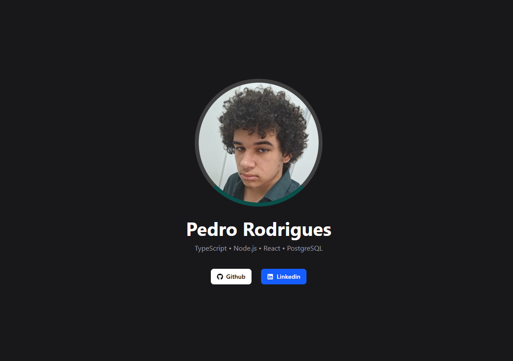

# 🚀 Personal Portfolio

My personal developer portfolio built to showcase my projects, skills, and experience as a backend-focused developer.

## 🧠 About

This project was designed with a clean and modern UI to highlight my work and technical stack.  
Even though I'm focused on backend development, this portfolio reflects my ability to build solid and responsive interfaces.

## 🛠️ Tech Stack

- React
- Vite
- Tailwind CSS
- Framer Motion

## 📸 Preview



## 🔗 Live Demo

👉 

## ⚙️ Running Locally

```bash
# clone the repository
git clone https://github.com/pedroprdgs/portfolio.git

# enter the folder
cd portfolio

# install dependencies
npm install

# run the project
npm run dev
```

## 📬 Contact

- Email: pedropereirarodrigues16@gmail.com
- LinkedIn: https://linkedin.com/in/pedro-rodrigues-aa7001274/